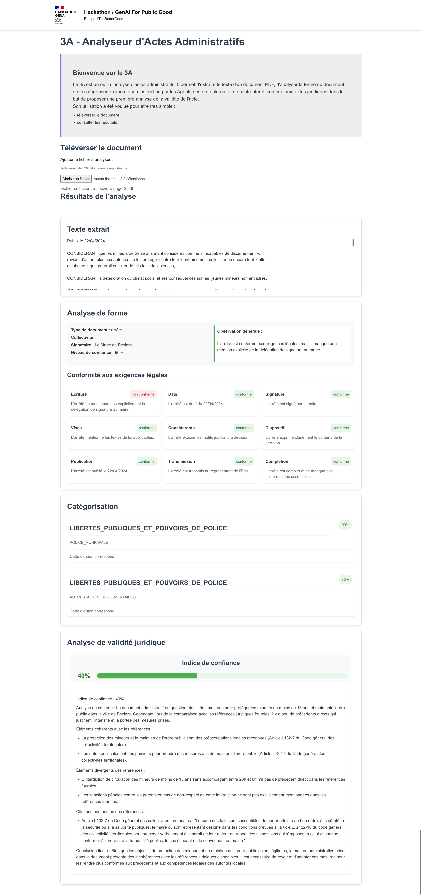

# Introduction

Track 2

Ce projet est un prototype qui vise à illustrer l'utilisation d'outils d'IA Générative pour permettre d'assister l'analyse de documents administratifs, en particulier les arrêtés municipaux.


## Documentation

Les slides de présentation du projet sont disponibles ici : [@/docs/slides.pdf](./docs/3A-Analyseurd'ActesAdministratifs.pdf)

##### 🏆 Critères d'évaluation  
| Critère            | Description | Poids (%) |
|--------------------|-------------|-----------|
| 🎯 **Pertinence**  | La solution répond-elle à un défi clair du service public ? | 25 |
| 📈 **Impact**      | Les résultats attendus sont-ils significatifs et mesurables ? | 25 |
| 🔧 **Faisabilité** | L’implémentation du MVP est-elle réaliste ? | 25 |
| 🌍 **Scalabilité** | La solution est-elle adaptable et conçue comme un bien commun numérique ? | 25 |


# Comment l'utiliser

## Démarrer le back-end 

```
pip install -r requirements.txt
API_KEY="XXX" python backend.py
```

# Démarrer le front-end

```
cd frontendtest
npm install
npm run dev
```

#

Se connecter sur la page d'accueil : 

```
http://localhost:5173/
```

## Démo

